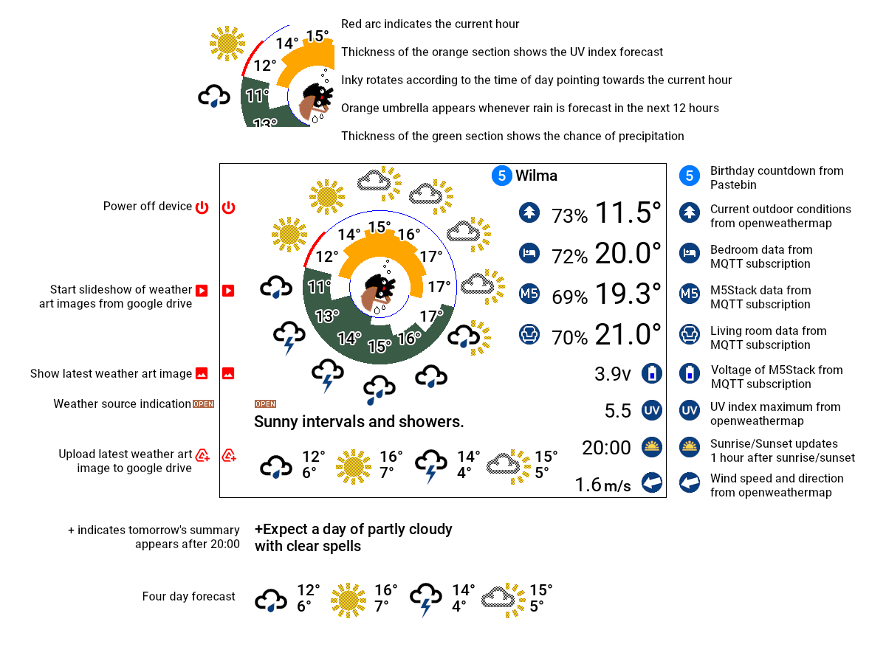
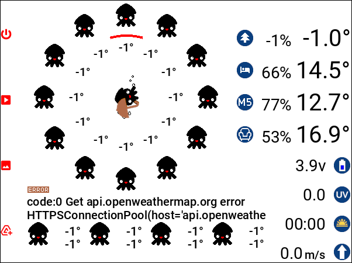
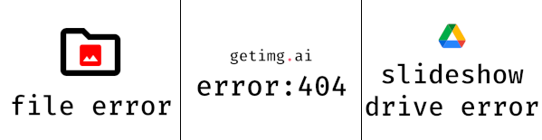

# Inky Impression e-ink weather station

The weather station runs on a Raspberry Pi Zero with a [Pimoroni Inky Impression](https://shop.pimoroni.com/products/inky-impression-5-7), displaying weather forecasts and sensor data. It retrieves weather data from [OpenWeather](https://openweathermap.org/) and communicates with other IoT devices by exchanging sensor data through a local MQTT broker. The display shows a four-day weather forecast alongside a 12-hour forecast represented on a clock dial.

The system uses an AI image generator from [getimg.ai](https://getimg.ai/) to create an [art image](#example-art-images) based on the current weather summary. A button press saves the image to Google Drive, and a slideshow feature allows viewing of previously stored images.

Starting at 07:00, the display updates every 15 minutes with weather and sensor data until 09:00, when a weather art image is generated and shown. The image remains on display for 30 minutes unless a button press shortens the duration. The artwork is created in the style of a randomly selected [artist](data/artists.json), with optional keywords to influence the artistic style. After midnight, updates pause for the display to rest.

New features include a birthday countdown list retrieved from [Pastebin](https://pastebin.com/raw/BVWgXY77) and a radial chart displaying the UV index forecast.<span title="Appears when there is no rain and the index is greater than 1">**¹**</span>


## Weather station guide


## Network architecture


APIs are used to fetch the weather forecast, generate the weather art image, and upload it. The weather station receives local sensor data from a MQTT broker, which also relays data to other IoT devices and databases.

## Example art images


This image was generated in the style of Katsushika Hokusai using the prompt:  
`Painting in the style of artist Katsushika Hokusai depicting Misty and light winds in January, featuring Mount Fuji`  
However, not all generated images are worth keeping. More examples of generated images can be found [here](/generated).

## getimg.ai generation data
 getimg.ai generates the weather art image using a text-to-image model based on the chosen settings and supplied prompt.
```python
{                                                                            
    "model": "absolute-reality-v1-6",                                                           # Replace with your desired model
    "prompt": f"Painting in the style of artist {artist_name} depicting {summary} in {month}, {keywords}",        # Your prompt for generating the image
    "negative_prompt": "Disfigured, cartoon, blurry, frame",
    "output_format": "jpeg",                                                                    # Specify JPEG format
    "width": 576,                                                                               # Your desired width x 64
    "height": 448,                                                                              # Your desired height
    "steps": 25,
    "guidance": 6                                                                               # 0-20 Higher guidance forces the model to better follow the prompt
}      
 ```    
More information on image generation is available in the getimg.ai Text to Image [API Reference](https://docs.getimg.ai/reference/poststablediffusiontexttoimage).

## io.adafruit.com dashboard


Sending sensor data to Adafruit IO is handled by another device running an MQTT broker.

## Error handling


This image indicates an error occurred while fetching OpenWeather data. It displays the Inky icon, -1° temperatures, and replaces the weather summary with part of the error message.



Examples of other errors: local file error, getimg.ai [response code](https://docs.getimg.ai/reference/errors) 404, slideshow google drive error  
As part of another project logs are sent to cloud logging services such as cloudwatch.

## Update frequency
The screen updates every 15 minutes while displaying the weather but stops updating between 00:00 and 07:00. However, this refresh rate may be considered fast for this type of screen. Pimoroni suggested the expected refresh rate was once per day or once every couple of days.

## Further improvements and features
⬜ Experiment with additional colour options on the e-ink display  
⬜ Automatically remove old images from the [generated](/generated) images folder  
⬜ Integrate a Xiaomi Mi Temperature/Humidity sensor via Bluetooth  
⬜ Publish the current birthday event to the MQTT broker for other IoT devices  
✅ Refactor the code to be more object-oriented, modular, and maintainable  
✅ Display the UV index similarly to the <span title="Probability of precipitation">**PoP**</span> - resolving any overlap issues  
✅ Expand the set of available weather icons  
✅ Add a birthday event countdown  


## This project was inspired by
[Enjoy the current weather with Picasso's painting](https://hackaday.io/project/190692-wow-enjoy-the-current-weather-with-picassos-pai)

[](https://hackaday.io/project/190692-wow-enjoy-the-current-weather-with-picassos-pai)

